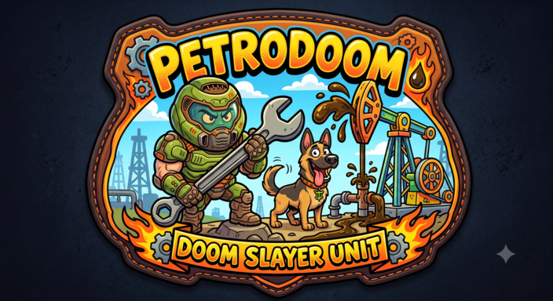

<p align="center"></p>

<h1 align="center">SEP-DOOM</h1>

<p align="center"><b>Simulador 2D interactivo de un separador trifásico horizontal</b><br>
gas · petróleo · agua — lazos de control, alarmas de planta y eventos de un flujograma causa-efecto</p>

<p align="center">
  <a href="https://edgardoomer.github.io/SEP-DOOM/">Demo en GitHub Pages</a> ·
  <a href="#cómo-usarlo">Cómo usarlo</a> ·
  <a href="#eventos-del-flujograma-causa-efecto">Eventos</a> ·
  <a href="#modelo">Modelo</a> ·
  <a href="#créditos">Créditos</a>
</p>

---

## Objetivo

Explicar de forma didáctica e interactiva cómo funciona un separador trifásico horizontal: qué hace cada internal —deflector, bafle perforado, vertedero y rompevórtices—, cómo los lazos de nivel y presión sostienen el régimen estable y qué ocurre cuando una válvula, la placa orificio o un bache de gas sacan al equipo de su punto de operación.

## Resumen

SEP-DOOM es una aplicación web educativa que simula en 2D un separador de 7 ft × 32 ft (20 000 BFPD, 3 MMSCFD) mediante balance de masa, vertedero de Francis y controladores PI sobre las válvulas de agua, petróleo y gas. El usuario ajusta la alimentación y los set points, opera bypass, bloqueos y drenajes, alterna entre unidades SI e inglesas y lanza nueve eventos tomados de un flujograma causa-efecto real: en modo automático un operador simulado ejecuta la respuesta del flujograma y en modo práctica la ejecuta el usuario, con alarmas HH/H/L/LL de planta, tendencias en vivo y registro de eventos. Está construida con HTML, CSS y JavaScript puros, sin dependencias, para desplegarse desde GitHub Pages o Netlify.

## Qué se ve en pantalla

- **Plano animado** del separador V-100 con simbología de P&ID: entrada de crudo con deflector, bafle perforado con estela turbulenta, vertedero a 5,2 ft con lámina vertiente, rompevórtices, drenajes de fondo, salida de gas con PCV-100 y placa orificio FE-100, PSV-100 a antorcha, PI/PT-100, indicadores de nivel de vidrio LG-101/LG-103, transmisores LT y lazos LIC/PIC con señal punteada.
- **Fluidos en movimiento**: burbujas de gas que ascienden, gotas de agua que decantan, gotas de petróleo que suben, petróleo que rebosa el vertedero y arena que se acumula en el fondo cuando hay exceso de sólidos.
- **Estaciones de control** completas: tee → bloqueo → válvula de control → bloqueo → tee, con bypass manual de globo y su porcentaje de apertura junto a cada válvula. Los bloqueos cerrados se dibujan en negro, como en un P&ID.
- **Faceplates** PIC-100, LIC-101 y LIC-103 con PV, SP, OP, modo AUTO/MAN, apertura del bypass, línea principal abierta/cerrada y las alarmas HH/H/L/LL.
- **Tendencias** de los últimos 10 minutos simulados (presión, interfase y nivel de petróleo con sus set points) y un **registro de eventos** con hora simulada.
- Selector **SI / Inglesas** (barg · m · m³/h · Sm³/h ⇄ psig · ft · bbl/día · MMSCFD) y panel de **Créditos**.

## Hoja de datos del separador simulado

| Característica | Valor |
|---|---|
| Capacidad de líquido | 20 000 BFPD (132 m³/h) |
| Capacidad de gas | 3 MMSCFD (3 540 Sm³/h) |
| Diámetro interior | 7 ft (2,13 m) |
| Longitud costura a costura | 32 ft (9,75 m) |
| Vertedero | 5,2 ft (1,585 m) |
| Presión de operación | 38 psig (2,62 barg) |
| Temperatura de operación | 140 °F (60 °C) |
| Presión de diseño | 120 psi — si se alcanza, la vasija estalla y la simulación se detiene |
| PSV-100 | abre a 70 psig, reasienta al 93 % |
| Alimentación por defecto | 12 076 bbl/día · 40 % de agua · 337 scf/bbl (60 % de la capacidad de líquido, 81 % de la de gas) |

### Alarmas (tomadas de la pantalla del operador)

| Variable | HH | H | L | LL |
|---|---|---|---|---|
| Presión PIT-100 | 60 psi | 40 psi | 15 psi | 10 psi |
| Nivel de interfase LIT-101 | 5,7 ft | 5,0 ft | 1,0 ft | 1,0 ft |
| Nivel de petróleo LIT-103 | 5,7 ft | 5,2 ft | 1,4 ft | 1,0 ft |

Las alarmas HH/LL y las consecuencias físicas (carry over, petróleo en la salida de agua, gas hacia tanques, sólidos en tanques, apertura de la PSV) ponen el estado del simulador en **¡DOOM!**.

### Lazos de control

| Lazo | Mide | Actúa sobre | Falla protegida |
|---|---|---|---|
| PIC-100 | presión del gas (PT-100) | PCV-100, salida de gas a compresión | PSV-100 a antorcha |
| LIC-101 | interfase agua/petróleo (LT-101) | LCV-101, salida de agua a tratamiento | — |
| LIC-103 | nivel de petróleo tras el vertedero (LT-103) | LCV-103, salida de petróleo a tanques | — |

Cada lazo es un PI con acción directa, anti-windup y transferencia sin salto entre AUTO y MAN. En MAN, la barra OP del faceplate se convierte en un deslizador que gobierna la válvula de control; el bypass de globo se regula siempre a mano.

## Cómo usarlo

1. Abre `index.html` en cualquier navegador moderno (doble clic basta; no necesita servidor) o entra a la demo publicada.
2. El separador arranca en régimen estable. Cambia el caudal, el corte de agua o el GOR y observa cómo las válvulas compensan.
3. Mueve los set points, pasa un lazo a MAN, abre un bypass o cierra una línea principal desde los faceplates.
4. Elige un **modo de eventos** y lanza uno de los nueve eventos:
   - **Automático**: un operador simulado espera la alarma, reacciona en 10–30 s y ejecuta en orden el ramal «SÍ se maneja» del flujograma (abre el bypass a la apertura que iguala el caudal, pasa a MAN y regula, cierra bloqueos, ejecuta los mantenimientos con su duración, corrige la falla y restablece la operación). Corre a ×20.
   - **Práctica**: la falla se inyecta y actúas tú. El panel lista los pasos con la pista de dónde ejecutarlos y botones para las tareas de mantenimiento; corre a ×10 hasta la alarma y baja a ×3 (×1 en eventos de gas) para que alcances a actuar. Si no actúas, el simulador detecta la consecuencia del ramal «NO» y la registra.
5. `Espacio` pausa y reanuda; el deslizador de velocidad va de ×1 a ×60; «Reiniciar a régimen estable» vuelve al punto de partida.

## Eventos del flujograma causa-efecto

Los nueve eventos son las causas raíz de [`flujos/flujograma_SEPARADORES_mermaid.mmd`](flujos/flujograma_SEPARADORES_mermaid.mmd) (flujograma causa-efecto elaborado con FlujoCE).

| Evento | Efecto → alarma | Ramal «SÍ se maneja» | Ramal «NO» |
|---|---|---|---|
| Válvula de agua no abre | aumento de nivel total → LAH/LAHH-101 | bypass de agua · modo manual · limpieza de stand pipe · solventes · revisión de línea de aire · drenaje de línea | carry over |
| Válvula de agua no cierra | pérdida de colchón de agua → LAL/LALL-101 | cerrar línea principal de agua · modo manual · mantenimiento | petróleo en tanques de agua |
| Válvula de petróleo no cierra | pérdida de nivel de petróleo → LAL/LALL-103 | cerrar línea principal de petróleo · modo manual · mantenimiento | arrastre de gas hacia tanques (burbujeo) |
| Válvula de petróleo no abre | aumento de nivel total → LAH/LAHH-103 | bypass de petróleo · modo manual · mantenimiento | carry over |
| Placa orificio muy pequeña | aumento de presión → PAH/PAHH | cambio de placa orificio · revisión de la instalación | apertura de PSV |
| PCV de gas no abre | aumento de presión → PAH/PAHH | bypass de gas · modo manual · cambio de TIT | apertura de PSV — estallido si P ≥ 120 psi |
| PCV de gas no cierra | caída de presión y subida de nivel → PAL/PALL | cerrar línea principal de gas · modo manual · cambio de TIT | carry over / implosión |
| Bache de gas | subida súbita de presión → PAH | apertura del bypass de gas | burbujeo hacia tanques |
| Exceso de sólidos | taponamiento — carrera de válvulas limitada, arena en el fondo | drenaje de arena por fondos (mitigación) · limpieza interior e instalación de desarenadores (registrada como parada de planta, no se simula) | sólidos en tanques |

Las fallas de válvula se simulan como una deriva de 0,5 %/s hacia cierre o apertura total; la placa orificio limita el colector de gas al 85 % del caudal de entrada; el bache de gas es una rampa de dos minutos hasta ×4,5 el GOR; los sólidos acumulan arena a 4 cm/min y restringen la carrera de LCV-101 y LCV-103.

## Modelo

- Balance de masa por compartimento (sección de separación y compartimento de petróleo) con paso de 0,05 s de tiempo simulado, geometría real de cilindro horizontal con cabezales 2:1 y tabla nivel–volumen.
- Rebose del vertedero con la fórmula de Francis; retorno si el compartimento de petróleo lo supera; agua sobre el vertedero cuando la interfase sube demasiado.
- Válvulas de líquido con caudal proporcional a la apertura y a √ΔP (presión del separador más columna de líquido, menos presión aguas abajo); válvula de gas con caudal másico creciente con la presión absoluta y flujo ahogado a ΔP/P₁ = 0,5. Retardo de primer orden (τ = 2 s) y límite de carrera de 25 %/s.
- Gas ideal a 140 °F; PSV con histéresis y alivio proporcional a la presión absoluta; estallido de vasija al alcanzar la presión de diseño.
- Detección de consecuencias físicas: arrastre de líquido al gas, petróleo por la salida de agua, gas por la salida de petróleo, agua sobre el vertedero hacia tanques y sólidos en la salida.
- El campo de partículas es visual: chorro del deflector, vórtices tras el bafle, deriva hacia cada boquilla proporcional al caudal real, lámina vertiente y salpicadura.

Simplificaciones: no hay transferencia de calor ni cambio de composición; la emulsión y el tiempo de retención no se modelan; los mantenimientos son temporizadores; la limpieza interior no se simula.

## Estructura del repositorio

```
index.html                 simulador completo, autocontenido (generado por build.js)
build.js                   ensambla index.html desde src/ incrustando las imágenes
src/head.html              HTML + CSS
src/model.js               unidades, hoja de datos, balance de masa, controladores, alarmas
src/draw.js                plano P&ID, fluidos y partículas sobre canvas
src/particles.js           campo de partículas y tendencias
src/ui.js                  faceplates, eventos del flujograma, panel de créditos, bucle principal
src/assets/                imágenes optimizadas que se incrustan en el HTML
logo_sepdoom.png           logo (cabecera y favicon)
creditos/                  material original del panel de créditos
flujos/                    flujograma causa-efecto de origen (Mermaid)
```

Para modificar el simulador edita los archivos de `src/` y regenera el HTML:

```bash
node build.js
```

No hay dependencias. Las tipografías (Barlow Condensed, IBM Plex Sans y IBM Plex Mono) se cargan desde Google Fonts y, sin conexión, se sustituyen por las del sistema.

## Publicación

- **GitHub Pages**: https://edgardoomer.github.io/SEP-DOOM/
- **Netlify**: https://sep-doom.netlify.app/

## Desarrollo

Autor: **Ing. Edgar Izurieta**. La configuración del separador, los set points
de alarma, los lazos de control y el flujograma causa-efecto provienen de la
operación real.

La implementación del simulador se hizo con asistencia de **Claude
(Anthropic)**, usado como herramienta de apoyo en la escritura y revisión del
código. La responsabilidad sobre el contenido técnico y los resultados es del
autor.

## Créditos

<p align="center"></p>

**Ing. Edgar Izurieta** — Ingeniero en Petróleos | Especialista en Datos e Inteligencia Artificial | Aspirante a Ingeniero de Reservorios / EOR | Creador de Contenido

- LinkedIn: <https://www.linkedin.com/in/edgarfer/>
- Instagram: <https://www.instagram.com/doom.petrolero>
- Sitio web: <https://edgarpetrolero.duckdns.org/>
- GitHub: <https://github.com/edgardoomer>

Configuración del separador, set points de alarma y flujograma causa-efecto aportados desde la operación real.
